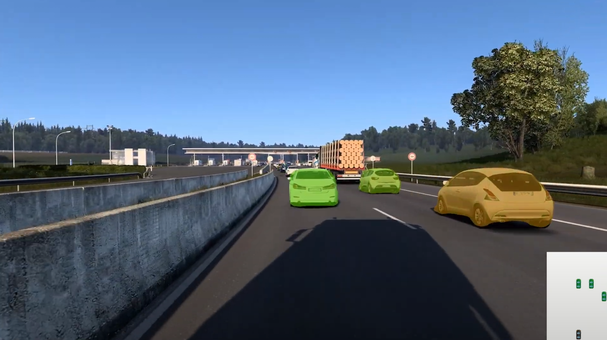
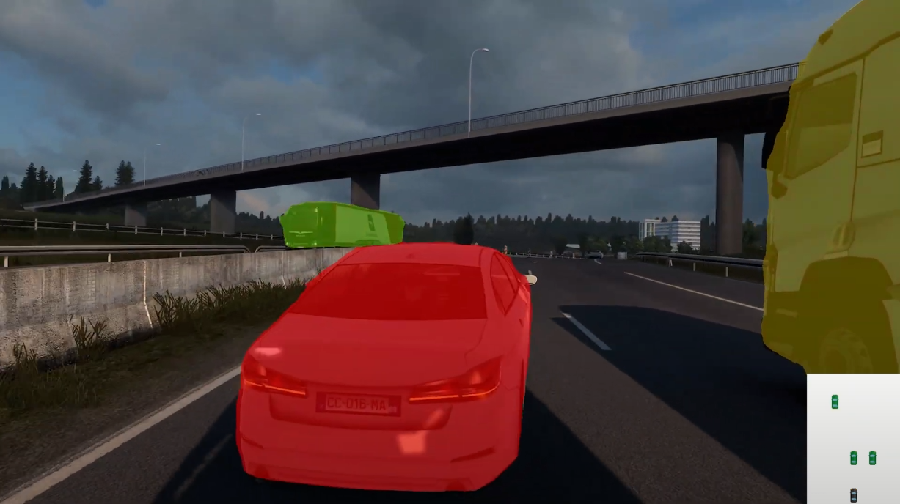

# Panoptic Risk & Occupancy Grid



## Introduction

This repository implements a **camera-only perception pipeline** that performs:

1. **Panoptic Segmentation** with Mask2Former  
2. **Real-time Risk Coloring** of vehicles and pedestrians  
3. **Bird’s-Eye Occupancy Grid Mapping** for downstream planning  

We **collected and uploaded** a custom ETS2 dashcam dataset (3000+ clips) to [Kaggle](https://www.kaggle.com/datasets/luluboy168/ets2-dashcam-dataset), covering normal driving, near-misses, and crash scenarios—and we developed the accompanying bird’s-eye labeling tool [BEV-Grid-Map-Labeling-Tool](https://github.com/Luluboy168/BEV-Grid-Map-Labeling-Tool) to annotate each clip with occupancy grids.

---

## Installation

```bash
git clone https://github.com/yourusername/panoptic-risk-grid.git
cd panoptic-risk-grid
pip install -r requirements.txt
```

---

## Training

To train the bird’s-eye view model:

```bash
python train.py --data-dir data/ets2 --output-dir models/bev
```

---

## Inference

Run both risk coloring and occupancy grid mapping in one step:

```bash
python inference.py \
  --input data/ets2/clip01.mp4 \
  --risk-output results/clip01_risk.mp4 \
  --grid-output results/clip01_grid.mp4
```

---

## Results

| Normal Driving                          | High-Risk Scenario                       |
|:---------------------------------------:|:----------------------------------------:|
|               |         |

- **Left:** Normal traffic—stable vehicles remain green.  
- **Right:** Crash scenario—impacting vehicle turns red.

---
